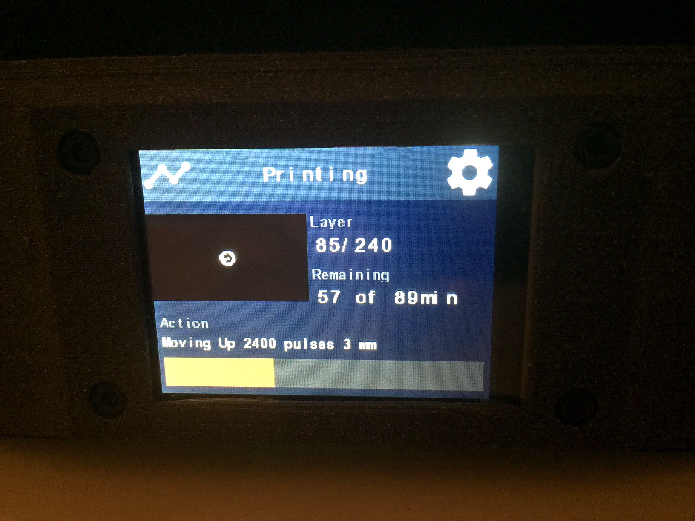
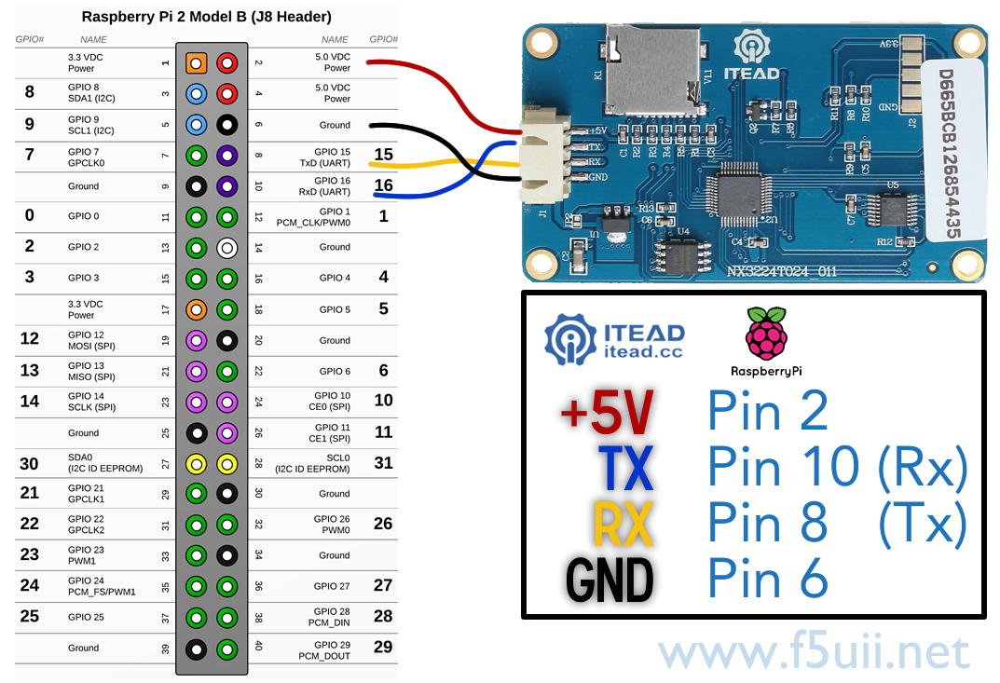

# NanoDLP-TouchScreen
Nextion Screen => NodeJS => NanoDLP

## Require 

- NanoDLP installed on a raspbery pi (2, 3, zero,...)
- A Nextion screen (Enhanced or not, 2.4", 3.2", 3.5", 5" or an other size, but you'll have to update the HMI file for now)

## Hardware installation
- Connect the raspberry pi to the nextion screen through the Serial GPIO's : 

- put the corresponding .tft file on a micro sd card, and plug it in the nextion screen. Power the raspberry pi and the Nextion screen'll automatically update its firmware with the good one (the screen'll go blank with status updating in red). You can then remove the micro sd card from the Nextion Screen (you can use the raspberry pi sd card!)

## MANDATORY : Enable /dev/ttyAMA0 For Raspberry Pi Zero and Raspberry Pi 3
	sudo raspi-config

=> Interfacing Option

=> Serial
  
=> NO
  
=> YES

	sudo nano /boot/config.txt
  
=> add this line : 
   
    dtoverlay=pi3-disable-bt

=> then

	sudo reboot
	sudo nano /boot/cmdline.txt
  
=> remove the word phase "console=serial0,115200" or "console=ttyAMA0,115200"

	sudo reboot

## Simple installation

On Raspberry pi zero, run : 

	mkdir /home/pi/nextion;(wget https://github.com/Tibus/TouchScreen-For-NanoDLP/releases/download/V0.3/pizero.tar.gz --no-check-certificate -O - | tar -C /home/pi/nextion -xz);cd /home/pi/nextion; sudo ./setup.sh

On Raspberry pi 2-3, run : 

	mkdir /home/pi/nextion;(wget https://github.com/Tibus/TouchScreen-For-NanoDLP/releases/download/V0.3/pi2_3.tar.gz --no-check-certificate -O - | tar -C /home/pi/nextion -xz);cd /home/pi/nextion; sudo ./setup.sh

